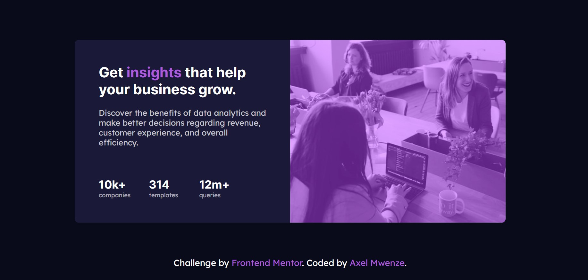

# Frontend Mentor - Stats preview card component solution

This is a solution to the [Stats preview card component challenge on Frontend Mentor](https://www.frontendmentor.io/challenges/stats-preview-card-component-8JqbgoU62).

## Table of contents

- [Overview](#overview)
    - [The challenge](#the-challenge)
    - [Screenshot](#screenshot)
    - [Links](#links)
- [My process](#my-process)
    - [Built with](#built-with)
    - [Continued development](#continued-development)

- [Author](#author)


## Overview

### The challenge

Users should be able to:

- View the optimal layout depending on their device's screen size

### Screenshot

- The desktop result
  
- Mobile result
  

### Links

- Solution URL: [GitHub](https://github.com/alexandre-dev29/stats-preview-card-component)
- Live Site URL: [Live Website](https://stats-preview-card-component-axel.netlify.app/)

## My process

### Built with

- Semantic HTML5 markup
- CSS custom properties
- Flexbox
- CSS Grid
- Desktop-first workflow
- Sass (Scss)
- Node-sass transpiler


### Continued development

To use this project  you must follow this steps
* you must have nodeJs install and run
```
  npm install
```
* for activate the watch for sass files you must run

```
  npm run watch-sass
```
* then for launching the website it is optional but you can use live-server and for that you can install it globally

```
  npm install -g live-server
```
and then in the project directory run
```
  live-server
```

## Author

- Frontend Mentor - [@alexandre-dev29](https://www.frontendmentor.io/profile/alexandre-dev29)
- Twitter - [@MwenzeAxel](https://twitter.com/MwenzeAxel)

